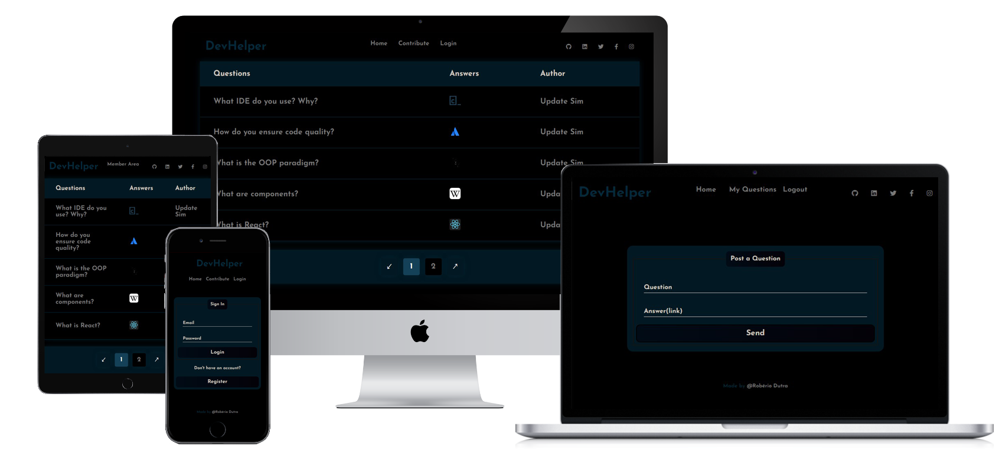

<h1 align="center">
  
</h1>

<p align="center">APP made with JS, TS and React 🤓</p>

<p align="center">
  
</p>

<br>

<h2 align="center">

[](https://skills.thijs.gg)

</h2>

<p align="center">🚀 This APP is part of the DevHelper project, its Backend can be found here » <h2 align="center"><a href="https://github.com/roberiodutra/ts-node-api">TS-NODE-API</a></h2></p>

<br>

<h4 align="center">
	🚧  TS-React-APP 🚀 under construction...  🚧
</h4>

<p align="center">
 <a href="#features">Features</a> •
 <a href="#technologies">Technologies</a> •
 <a href="#prerequisites">Prerequisites</a> •
 <a href="#author">Author</a>
</p>

<br>

### Features

- [x] Login and registration page.
- [x] Panel for members to register and edit questions.
- [x] Panel for admin, with CRUD in users and questions.
- [x] Home page displaying published questions, with navigation.
- [x] Unitary tests.
- [x] 100% test coverage.
- [x] API mocked with Mock Service Worker(MSW).
- [x] Style made entirely with SASS.

<br>

### Technologies

The following tools were used in building this APP:

- [Reactjs]()
- [Javascript]()
- [TypeScript]()
- [SASS]()
- [Jest]()
- [Mock Service Worker]()
- [Yup]()
- [Node.js](https://nodejs.org/en/)
- [Vite]()
- [SWC]()

<br>

### Prerequisites

Before starting, you will need to have the following tools installed on your machine:
[Git](https://git-scm.com), [Node.js](https://nodejs.org/en/).
Besides, it's good to have an editor to work with the code like [VSCode](https://code.visualstudio.com/)

### 🎲 Running the FrontEnd (server)

```bash
# Clone this repository
$ git clone <git@github.com:roberiodutra/ts-react-app.git>

# Access the project folder in terminal/cmd
$ cd ts-react-app

# Install the dependencies
$ npm install

# Run the application in development mode
$ npm run dev

# The server will start on port:5173 - access <http://127.0.0.1:5173/>
```

<br>

### Author

<a 
  href="https://www.linkedin.com/in/roberiodutra/"
  rel="nofollow">

</a>

<br>

📝 License

This project is under license <a href="/LICENSE">MIT</a>.
